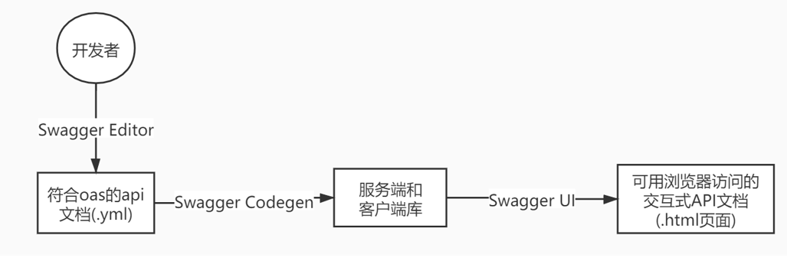
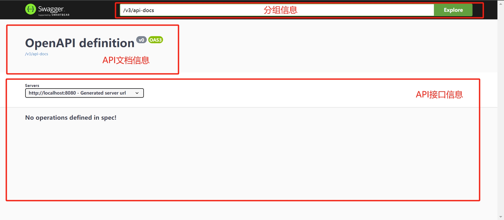
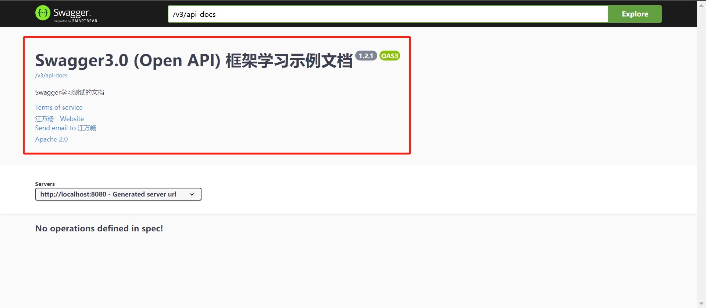
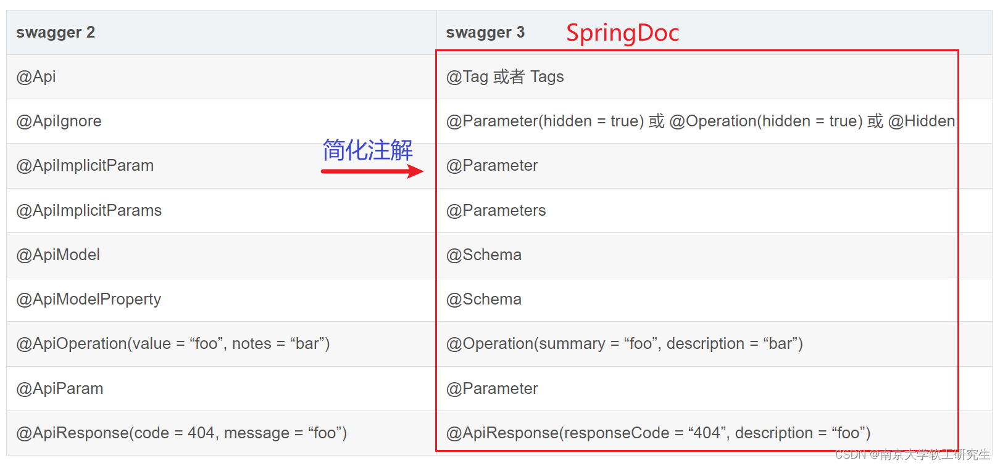
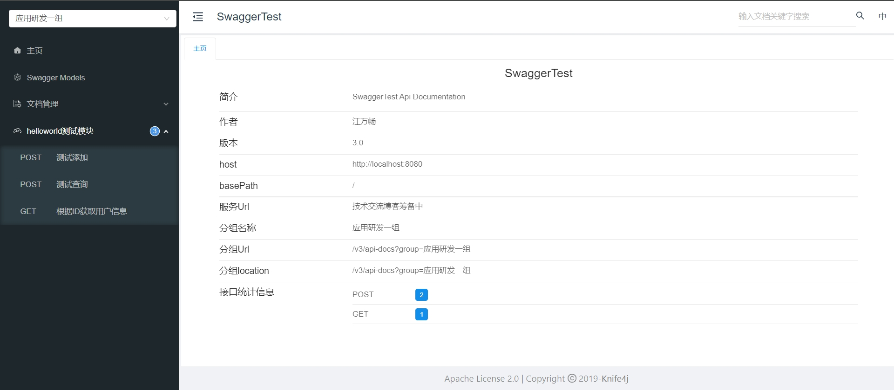
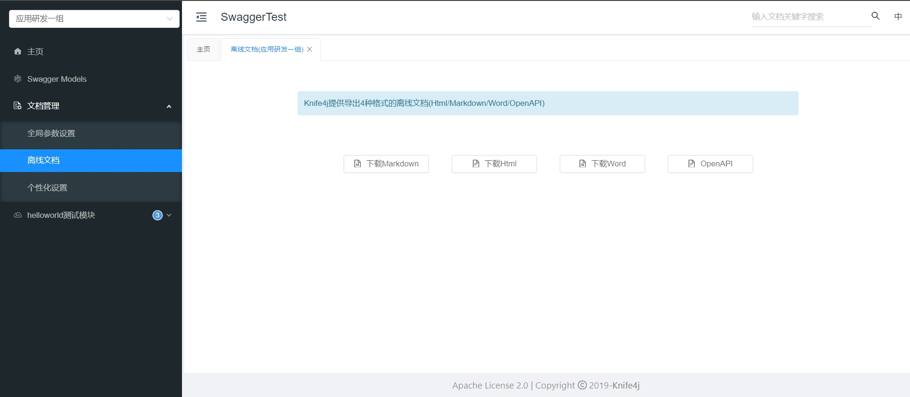

## 自动化接口文档工具Swagger实践

### 1. 接口文档常见问题
- 接口文档不存在，需要靠抓包获取

- 接口更换后文档不及时更新

- 接口文档写错

-----


### 2. 自动化接口文档生成方案介绍

#### 2.1 ApiDoc
- 地址：https://apidocjs.com/
- Github：https://github.com/apidoc/apidoc
- 简介：ApiDoc是一个轻量级的在线REST接口文档生成系统，支持多种主流语言，包括Java、C、C#、PHP和JavaScript等。使用者仅需要按照要求书写相关注释，就可以生成可读性好、界面美观的在线接口文档。
```java 
 /**
     * @apiGroup Product
     * @api {GET} /product/{id}  查询一个产品
     * @apiDescription 接口描述xxx
     * @apiParam {String} id 产品id(必填*)
     * @apiSuccessExample SuccessExample
     * HTTP/1.1 200
     * {
     * id: 'xxx',
     * name: 'xxx',
     * desc: 'xxxx'
     * }
     * @apiErrorExample ErrorExample
     */
    @GetMapping("/{id}")
    public Product detail(@PathVariable String id)
    {
        return JsonData.buildSuccess();
    }
```
- 优点：
  - 不入侵代码
  - 支持跨语言使用
  - 界面友好简洁
- 缺点
  - 依赖node/npm环境
- 相关博客：https://blog.csdn.net/u014172271/article/details/86587237

#### 2.2 Swagger
- 地址：https://swagger.io/
- 简介：Swagger 是一个 RESTful API 的开源框架，它的主要目的是帮助开发者设计、构建、文档化和测试 Web API。Swagger 的核心思想是通过定义和描述 API 的规范、结构和交互方式，以提高 API 的可读性、可靠性和易用性，同时降低 API 开发的难度和开发者之间的沟通成本。
- 优点：
  - Java生态友好，支持SpringMVC、SpringBoot、SpringCloud等主流Java框架
  - 界面友好简洁

- 缺点：
  - 代码侵入性强

-----


### 3. Swagger实践

#### 3.1 Swagger介绍

- 工作流程：
   **Swagger Editor**: 类似于markedown编辑器的编辑Swagger描述文件的编辑器，该编辑支持实时预览
   描述文件的更新效果。也提供了在线编辑器和本地部署编辑器两种方式。
    **Swagger Codegen**: 通过Codegen 可以将描述文件生成html格式和cwiki形式的接口文档，同时也能生
   成多钟语言的服务端和客户端的代码。支持通过jar包，docker，node等方式在本地化执行生成。也可
   以在后面的Swagger Editor中在线生成。
    **Swagger UI**:提供了一个可视化的UI页面展示描述文件。接口的调用方、测试、项目经理等都可以在该
   页面中对相关接口进行查阅和做一些简单的接口请求。该项目支持在线导入描述文件和本地部署UI项
   目。



- Springfox
  是一套可以帮助Java开发者自动生成API文档的工具，它是基于Swagger 2.x基础上开发的。Springfox是一个用于集成Swagger2.x到Spring应用程序中的库。而且Springfox提供了一些注解来描述API接口、参数和返回值，并根据这些信息生成Swagger UI界面，从而方便其他开发人员查看和使用您的API接口。但是随着时间的推移，Swagger2.x终究成为历史，实际上Springfox从3.0.0版本（2020年7月14日）开始就一直没有更新

- Springdoc
  它是一个集成Swagger UI和ReDoc的接口文档生成工具，在使用上与springfox-boot-starter类似，但提供了更为灵活、功能更加强大的工具。其中除了可以生成Swagger UI风格的接口文档，还提供了ReDoc的文档渲染方式，可以自动注入OpenAPI规范的JSON描述文件，支持OAuth2、JWT等认证机制，并且支持全新的OpenAPI 3.0规范，一直在活跃更新中

#### 3.2 SpringBoot 2.x 集成Swagger3.0
添加springdoc依赖

```xml
<dependency>
    <groupId>org.springdoc</groupId>
    <artifactId>springdoc-openapi-ui</artifactId>
    <version>1.7.0</version>
</dependency>
```

访问路径：http://server:port/context-path/swagger-ui.html



#### 3.3 API文档信息配置

通过配置类的方式创建OpenAPI的Bean对象即可创建Swagger3.0的文档说明

或者通过@OpenAPIDefinition注解的方式进行配置

```java
@Configuration
public class SwaggerOpenApiConfig {

    /***
     * 构建Swagger3.0文档说明
     * @return 返回 OpenAPI
     */
    @Bean
    public OpenAPI customOpenApi() {

        // 联系人信息(contact)，构建API的联系人信息，用于描述API开发者的联系信息，包括名称、URL、邮箱等
        // name：文档的发布者名称 url：文档发布者的网站地址，一般为企业网站 email：文档发布者的电子邮箱
        Contact contact = new Contact()
                .name("江万畅")                             // 作者名称
                .email("jiangwch02@inspur.com")                   // 作者邮箱
                .url("https://www.cnblogs.com/antLaddie/")  // 介绍作者的URL地址
                .extensions(new HashMap<String, Object>()); // 使用Map配置信息（如key为"name","email","url"）

        // 授权许可信息(license)，用于描述API的授权许可信息，包括名称、URL等；假设当前的授权信息为Apache 2.0的开源标准
        License license = new License()
                .name("Apache 2.0")                         // 授权名称
                .url("https://www.apache.org/licenses/LICENSE-2.0.html")    // 授权信息
                .identifier("Apache-2.0")                   // 标识授权许可
                .extensions(new HashMap<String, Object>());// 使用Map配置信息（如key为"name","url","identifier"）

        //创建Api帮助文档的描述信息、联系人信息(contact)、授权许可信息(license)
        Info info = new Info()
                .title("Swagger3.0 (Open API) 框架学习示例文档")      // Api接口文档标题（必填）
                .description("Swagger学习测试的文档")     // Api接口文档描述
                .version("1.2.1")                                  // Api接口版本
                .termsOfService("https://example.com/")            // Api接口的服务条款地址
                .license(license)                                  // 设置联系人信息
                .contact(contact);                                 // 授权许可信息
        // 返回信息
        return new OpenAPI()
                .openapi("3.0.1")  // Open API 3.0.1(默认)
                .info(info);       // 配置Swagger3.0描述信息
    }
  
  	//实现分组
  	@Bean
    public GroupedOpenApi publicApi() {
        return GroupedOpenApi.builder()
                .group("springshop-public")
                .pathsToMatch("/public/**")
                .build();
    }

    @Bean
    public GroupedOpenApi adminApi() {
        return GroupedOpenApi.builder()
                .group("springshop-admin")
                .pathsToMatch("/admin/**")
                .addOpenApiMethodFilter(method -> method.isAnnotationPresent(Admin.class))
                .build();
    }
}
```
效果图如下



#### 3.4 SpringDoc常用配置

```yaml
springdoc:
  swagger-ui:
    # 修改Swagger UI路径
    path: /swagger-ui.html
    # 开启Swagger UI界面 可在生产环境关闭
    enabled: true
  api-docs:
    # 修改api-docs路径
    path: /v3/api-docs
    # 开启api-docs 可在生产环境关闭
    enabled: true
  # 配置需要生成接口文档的扫描包
  packages-to-scan: com.macro.mall.tiny.controller
  # 配置需要生成接口文档的接口路径
  paths-to-match: /brand/**,/admin/**
```


#### 3.5 SpringDoc常用注解

相对于SpringFox，SpringDoc提供了更简洁、直观的注解方式



- @Tag 描述类的信息

```java
/**
name：表示标签的名称，必填属性
description：表示标签的描述信息
**/
@Tag(name = "用户接口", description = "用户管理相关接口")
@RestController
@RequestMapping("/users")
public class UserController {

}
```
- @Schema 描述实体类属性的描述、示例、验证规则等
```java
/**
description：描述该类或者该属性的作用
name：指定属性名。该属性只对属性有效，对类无效
title：用于显示在生成的文档中的标题
requiredMode：用于指定该属性是否必填项。枚举Schema.RequiredMode内可选值如下：
	默认AUTO：可有可无；REQUIRED：必须存在此字段(会加红色*)；NOT_REQUIRED：不需要存在此字段
accessMode：用于指定该属性的访问方式。
    包括AccessMode.READ_ONLY（只读）、AccessMode.WRITE_ONLY（只写）、AccessMode.READ_WRITE（读写）
format：用于指定该属性的数据格式。例如：日期格式、时间格式、数字格式
example：为当前的属性创建一个示例的值，后期测试可以使用此值
maxLength 、 minLength：指定字符串属性的最大长度和最小长度
maximum 、 minimum：指定数值属性的最大值和最小值
pattern：指定属性的正则表达式模式
type： 用于指定该属性的数据类型（integer，long，float，double，string，byte，binary，
boolean，date，dateTime，password）。
如 @Schema=(type=“integer”)
**/

@Schema(name = "用户", description = "用户实体类")
@Data
public class User {
    @Schema(name = "用户id", type = "long")
    private Long id;
    @Schema(name = "用户名", type = "long")
    private String name;
    @Schema(name = "密码", type = "password", minLength = "6", maxLength = "20")
    private String password;
}
```

- @Operation 常用在Controller的方法上，描述该Api的信息
```java
/**
summary：用于简要描述API操作的概要
description ：用于详细描述API操作的描述信息。
hidden：是否隐藏
operationId：操作的唯一标识符，建议使用唯一且具有描述性的名称
parameters：用于指定API操作的参数列表，包括路径参数、请求参数、请求头部等。可以使用@Parameter注解进一步定义参数。
requestBody：用于定义API操作的请求体，可以使用@RequestBody注解进一步定义请求体。
responses：用于定义 API 操作的响应列表，包括成功响应和错误响应。可以使用@ApiResponse注解进一步定义响应。
security：用于对API操作进行安全控制，可以使用@SecurityRequirement注解进一步定义安全需求。
deprecated：表示该API操作已经过时或不推荐使用。
**/

@Operation(
  summary = "操作摘要",
  description = "操作的详细描述",
  operationId = "operationId",
  tags = "tag1",
  parameters = {
    @Parameter(name = "param1", description = "参数1", required = true),
    @Parameter(name = "param2", description = "参数2", required = false)
  },
  requestBody = @RequestBody(
    description = "请求描述",
    required = true,
    content = @Content(
      mediaType = "application/json",
      schema = @Schema(implementation = RequestBodyModel.class)
    )
  ),
  responses = {
    @ApiResponse(responseCode = "200", description = "成功", content = @Content(mediaType = "application/json", schema = @Schema(implementation = ResponseModel.class))),
    @ApiResponse(responseCode = "400", description = "错误", content = @Content(mediaType = "application/json", schema = @Schema(implementation = ErrorResponseModel.class)))
  }
)
public void Operation() {
  // 逻辑
}
```

- @Parameter 用于描述API接口中的参数

```java
/**
name : 指定的参数名
in：参数来源，可选 query、header、path 或 cookie，默认为空，表示忽略
ParameterIn.QUERY 请求参数
ParameterIn.PATH 路径参数
ParameterIn.HEADER header参数
ParameterIn.COOKIE cookie 参数
description：参数描述
required：是否必填，默认为 false
schema ：参数的数据类型。如 schema = @Schema(type = “string”)
**/

@Operation(summary = "根据用户名查询用户列表")
@GetMapping("/query/{username}")
public List<User> queryUserByName(@Parameter(name = "username", in = ParameterIn.PATH,
    description = "用户名",required = true) @PathVariable("username") String userName) {
    return new ArrayList<>();
}
```
- @Parameters 与 @Parameter作用相同，但可以批量添加指定多个参数
```java
@Parameters({
  @Parameter(
    name = "param1",
    description = "description",
    required = true,
    in = ParameterIn.PATH,
    schema = @Schema(type = "string")
  ),
  @Parameter(
    name = "param2",
    description = "description",
    required = true,
    in = ParameterIn.QUERY,
    schema = @Schema(type = "integer")
  )
})
```

- @ApiResponse 用于描述API的响应信息 ，@ApiResponses的使用与上述同理指定多个响应信息
```java
/**
responseCode：响应的 HTTP 状态码
description：响应信息的描述
content：响应的内容
**/
@ApiResponse(responseCode = "200", description = "查询成功", content = @Content(schema = @Schema(implementation = User.class)))
@ApiResponse(responseCode = "404", description = "查询失败")
@GetMapping("/users/{id}")
public ResponseEntity<User> getUserById(@PathVariable("id") Long id) {
    // ...
}
```

- @Hidden 可以用在各种地方，隐藏不必要的信息


#### 3.6 SpringDoc权限认证

- @SecurityScheme 用于定义API的安全模式。通过使用@SecurityScheme注解，我们可以为API定义多种安全方案，并指定每种方案的相关属性，例如认证类型、授权URL、令牌URL、作用域等。可以定义全局的，也可以指定某个类
```java
//全局定义
@SecurityScheme(
  name = "api_token", 
  type = SecuritySchemeType.HTTP,
  scheme ="bearer", 
  in = SecuritySchemeIn.HEADER)
@SpringBootApplication
public class SwaggerTestApplication {
    public static void main(String[] args) {
        SpringApplication.run(SwaggerTestApplication.class, args);
    }
}

//配置中生效
@Configuration
public class SwaggerOpenApiConfig {
    @Bean
    public OpenAPI customOpenApi() {
        return new OpenAPI()
                 ...
                .security(security(Arrays.asList(new SecurityRequirement().addList("api_token"))));
    }
}

//指定方法是否使用
//@SecurityRequirements() 里面需要一个String数组，里面列出需要使用的@SecurityScheme，例如我们这里的api_token。如果不写就说明不需要任何的安全模式，同样这个注解也可以放到@Operation中

@RestController
@RequestMapping(value = "/admin",produces =  "application/json")
public class AuthController {
    ...
    @SecurityRequirements("api_token")
    @PostMapping("/login")
    public Result<String> login(@RequestBody LoginRequest request){
        return Result.ok("123");
    }
}
```

-----

### 4. Swagger增强

#### 4.1 增强方案
- YApi ：YApi 是一个可本地部署的、打通前后端及 QA 的、可视化的接口管理平台。可以帮助我们让 swagger 页面的体验更加友好。

- Knife4j ：Swagger 生成 API文档的增强解决方案，前身是 swagger-bootstrap-ui。

#### 4.2 Knife4j介绍

- 地址：https://doc.xiaominfo.com/

- 简介：Knife4j是对Swagger文档的增强解决方案，底层是对Springfox/Springdoc的（boot整合swagger）的封装，是对接口文档UI进行优化，取名 kni4j 是希望它能像一把匕首一样小巧,轻量,并且功能强悍


#### 4.3 Knife4j实践

引入pom依赖 

```xml
<dependency>
    <groupId>com.github.xiaoymin</groupId>
    <artifactId>knife4j-openapi3-spring-boot-starter</artifactId>
    <version>4.4.0</version>
</dependency>
```
knife4j文档访问地址：http://ip:port/doc.html




#### 4.3 Knife4j增强
详细说明文档：https://doc.xiaominfo.com/docs/features

在配置文件中添加以下配置开启增强功能
```yaml
knife4j:
	enable: true
```

- 生产环境关闭文档
  knife4j提供了另一种方式对生产环境接口文档进行屏蔽
```yaml
spring:
	profiles: prod
knife4j:
	enable: true
	#开启生产环境屏蔽
	production: true
```
- 导出离线文档，导出当前逻辑分组下所有接口的文档



#### 4.4 微服务文档聚合

- 地址： https://doc.xiaominfo.com/docs/middleware-sources
- 说明：在微服务架构下，如果给每个微服务都配置文档，那么每个微服务的接口文档都有自己独立的访问地址，这样要一个个打开每个微服务的文档非常麻烦。一般我们会采用聚合的办法，将所有微服务的接口整合到一个文档中。传统的整合方法需要在gateway中进行大量配置，十分繁琐。Knife4j提供了一个针对在Spring Cloud Gateway网关进行聚合的组件，开发者可以基于此组件轻松的聚合各个子服务的OpenAPI文档


-----
